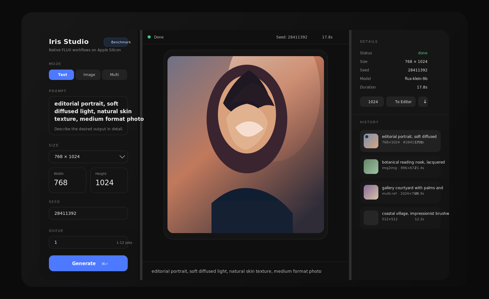
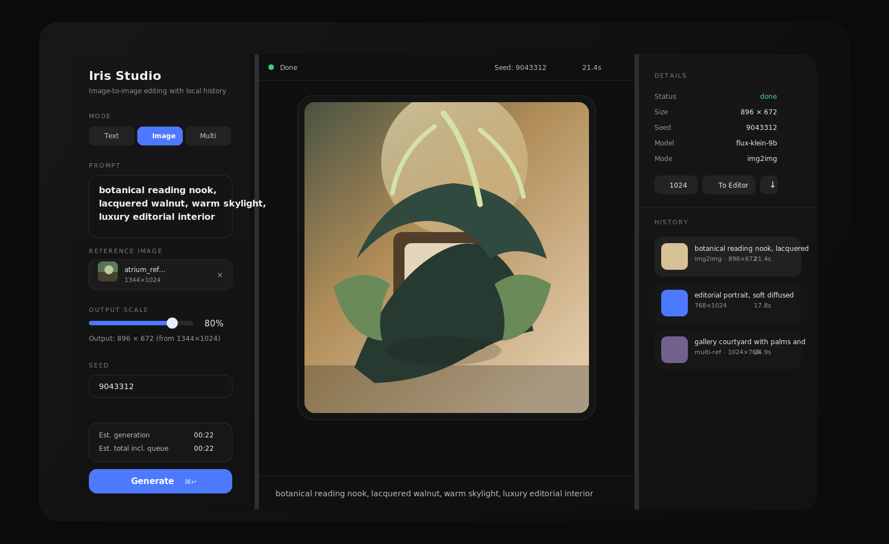
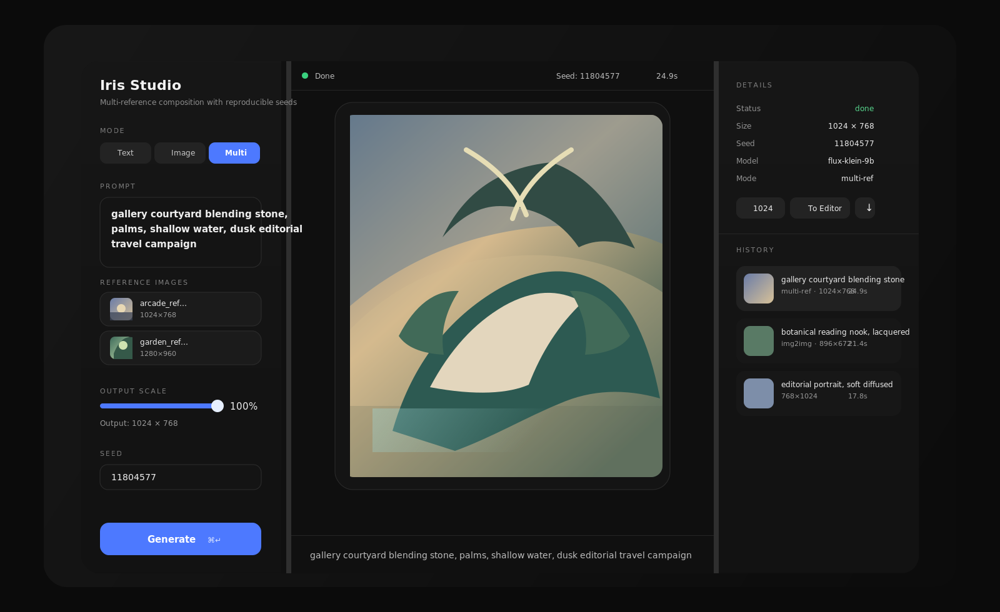

# Iris Studio

Iris Studio is a local-first image generation and editing app for Apple Silicon Macs. It wraps the native [`iris.c`](https://github.com/antirez/iris.c) CLI with a three-panel web UI for text-to-image, image-to-image, multi-reference generation, queueing, benchmarking, and local history.

This project is intended to run on a Mac with an M-series GPU. Inference is native only. No Docker is used for generation.

## Interface Preview

These previews show the current app layout with placeholder artwork so the README can illustrate the workflow without using local generated outputs.



<p align="center">
  
  
</p>

## What It Does

- Text-to-image, image-to-image, and multi-reference generation
- One-job-at-a-time execution with a real queue
- Progress bars, elapsed time, ETA, and benchmark-based timing estimates
- History browser with pagination, bulk select, bulk delete, and download
- Prompt-file batch queueing
- Local storage for outputs, uploads, thumbnails, and SQLite job metadata

## Requirements

- macOS on Apple Silicon: M1, M2, M3, or M4
- Xcode Command Line Tools
- Node.js 20 or newer
- npm 10 or newer
- A local checkout of `antirez/iris.c`
- FLUX Klein 9B weights stored outside this repo

## Hardware Recommendations

Iris Studio is built for Apple Silicon and is most comfortable on machines with higher unified memory.

- Minimum usable: M1, M2, M3, or M4 with 16 GB unified memory
- Recommended: Pro or Max-class chip with 24 GB to 36 GB unified memory
- Best experience: Max or Ultra-class machine with 48 GB or more unified memory

Practical guidance:

- 16 GB works for basic use, but expect tighter headroom and slower recovery if you keep many other heavy apps open
- 24 GB to 36 GB is a much better target if you plan to use image editing, multi-reference workflows, queueing, and benchmarking regularly
- 48 GB or more is the most comfortable option for larger jobs, longer sessions, and keeping the system responsive while generating

## RAM and Storage Expectations

This app relies on Apple unified memory, so the model, generation process, browser, and the rest of macOS all compete for the same pool.

- Absolute floor: 16 GB unified memory
- Recommended floor: 24 GB unified memory
- Comfortable for sustained use: 36 GB to 48 GB unified memory

Storage expectations:

- Model weights require significant disk space and should live outside this repo
- Generated images, thumbnails, uploads, and the SQLite database are stored locally under `storage/`
- Keep at least 50 GB of free disk space available if you want room for the model, build artifacts, and ongoing image output history

## 1. Install Apple Tooling

Install Xcode Command Line Tools if you do not already have them:

```bash
xcode-select --install
```

Check your Node and npm versions:

```bash
node -v
npm -v
```

## 2. Clone and Build `iris.c`

Clone `iris.c` somewhere outside this repo, then build it with Metal support:

```bash
mkdir -p ~/AI
cd ~/AI
git clone https://github.com/antirez/iris.c.git
cd iris.c
make mps
```

Confirm the binary exists:

```bash
./iris --help
```

## 3. Download the Model

The app expects the default model name `flux-klein-9b`, and the model directory must be provided through `IRIS_MODEL_DIR`.

Example layout:

```text
/Users/yourname/AI/models/flux-klein-9b
```

Keep model weights outside this repository.

## 4. Clone This Repo

```bash
git clone https://github.com/YOUR_ACCOUNT/iris-studio.git
cd iris-studio
```

## 5. Install Dependencies

```bash
npm install
```

## 6. Configure the Environment

Copy the example environment file:

```bash
cp .env.example .env
```

Then edit `.env` for your machine:

```env
IRIS_BIN=/Users/yourname/AI/iris.c/iris
IRIS_MODEL_DIR=/Users/yourname/AI/models/flux-klein-9b
IRIS_OUTPUT_DIR=/Users/yourname/iris-studio/storage/outputs
IRIS_UPLOAD_DIR=/Users/yourname/iris-studio/storage/uploads
IRIS_THUMB_DIR=/Users/yourname/iris-studio/storage/thumbs
IRIS_DB_PATH=/Users/yourname/iris-studio/storage/app.db
```

Notes:

- `IRIS_BIN` should point to the binary built by `make mps`
- `IRIS_MODEL_DIR` should point directly at the `flux-klein-9b` model directory
- Storage directories are local-only and should not be committed

## 7. Start the App

```bash
npm run dev
```

This starts:

- Web UI: `http://localhost:3000`
- API: `http://127.0.0.1:8787`

## 8. Verify the Setup

Open the UI and generate a small `512x512` text-to-image prompt first.

You can also verify the API directly:

```bash
curl http://127.0.0.1:8787/api/health
```

Expected response:

```json
{"status":"ok","model":"flux-klein-9b"}
```

## Daily Usage

### Text mode

Use the `Text` tab for pure text-to-image generation.

- Enter a descriptive prompt
- Set width and height in multiples of 16
- Maximum width or height is `1792`
- Use the queue count for repeated runs

### Image mode

Use the `Image` tab for image-to-image editing.

- Upload one reference image
- Enter the output prompt
- Output size is automatically fit within the model limit

### Multi mode

Use the `Multi` tab for multi-reference generation/editing.

- Upload two or more images
- Enter the target prompt
- The app fits the output size within model and attention limits

### Batch prompts

You can upload a text file containing one prompt per line. The app will queue one job per prompt. In image modes, the same uploaded reference image set is reused for each prompt.

### Benchmarking

Use the benchmark control in the left panel header to measure your machine. Iris Studio stores benchmark samples and uses them to improve ETA prediction for both text-to-image and image-to-image workloads.

## Development Commands

```bash
npm run dev
npm run dev:api
npm run dev:web
npm run typecheck
npm run build
```

## Project Structure

```text
.
├── apps/web/           # Next.js frontend
├── services/api/       # Fastify API and iris worker
├── storage/            # Local runtime data only
├── .env.example
├── package.json
└── README.md
```

## Local Data

The following are runtime-only and should stay out of git:

- generated images
- uploaded reference images
- thumbnails
- SQLite database
- `.env` and other machine-local config
- model weights
- local `iris.c` checkout

## Troubleshooting

### `iris` binary not found

Check that `IRIS_BIN` points to the built binary from your local `iris.c` checkout.

### Model not found

Check that `IRIS_MODEL_DIR` points directly to the `flux-klein-9b` folder.

### App starts but generation fails

Common causes:

- dimensions are not multiples of 16
- one side is above `1792`
- image-edit mode was used without required references
- `iris.c` or the model path is wrong

### API works but images are missing

Check the storage paths in `.env` and confirm the app can write to:

- `storage/outputs`
- `storage/uploads`
- `storage/thumbs`

## License

Code in this repo can be licensed separately from the model. Model usage depends on the FLUX Klein 9B license terms from its source.
