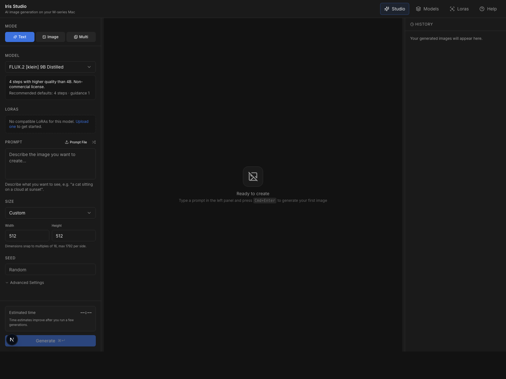
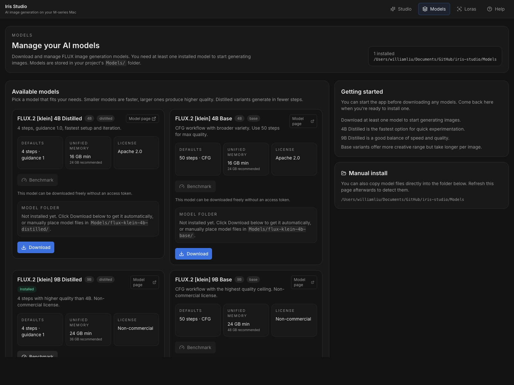
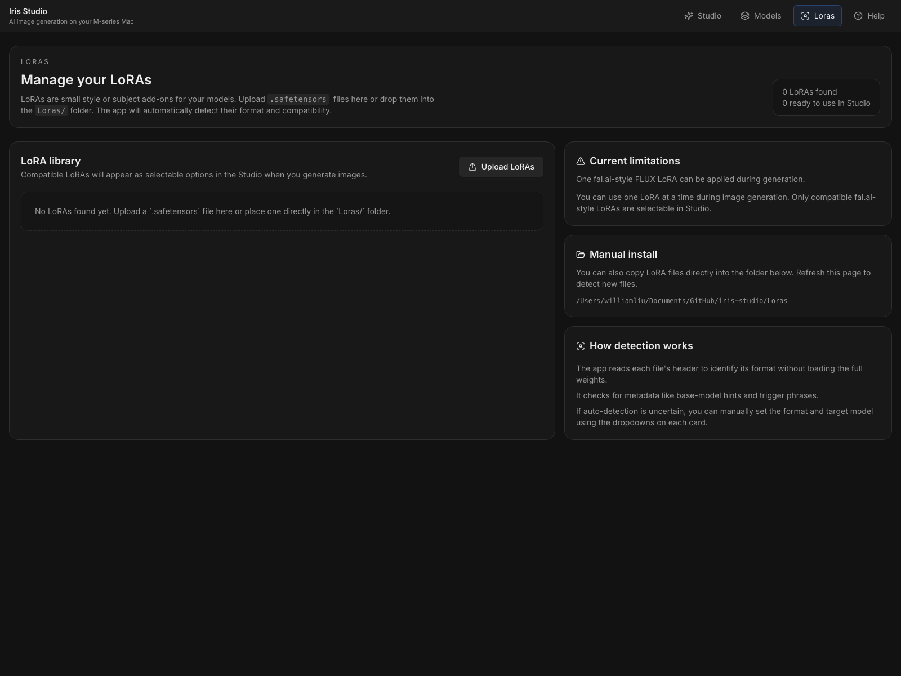

# Iris Studio

Iris Studio is a local-first image generation and editing app for Apple Silicon Macs. It wraps the native [`iris.c`](https://github.com/antirez/iris.c) CLI with a three-panel web UI for text-to-image, image-to-image, multi-reference generation, queueing, benchmarking, and local history.

This project is intended to run on a Mac with an M-series GPU. Inference is native only. No Docker is used for generation.

## Quick Start

Run the bootstrap script for a one-command local setup:

```bash
./quickstart.sh
```

The script will:

- clone or reuse a local `antirez/iris.c` checkout in `vendor/iris.c`
- apply `vendor/iris-lora.patch` if needed
- build `iris.c` with `make mps`
- create the local `Models/`, `Loras/`, and `storage/` folders inside this repo
- write `.env` with repo-local paths
- install npm dependencies
- start the app

The app can start before any models are downloaded. `quickstart.sh` no longer asks about FLUX downloads. Use the web `Models` page later to fetch 4B, 9B, or Z-Image weights from inside the UI, or place a full supported model folder in `Models/`.

You can also place `.safetensors` LoRAs in `Loras/`. The app will inspect their safetensors metadata, classify likely `fal.ai` vs `ComfyUI / Kohya` format, and match them to compatible FLUX Klein model variants when possible.

## Interface Preview

These previews are captured from a live local run of the app.

### Studio Workspace

The main Studio layout keeps settings on the left, the active canvas in the center, and history on the right.



### Models Page

The Models page handles downloads, install state, hardware guidance, and benchmarking.



### LoRA Library

The LoRAs page is where local adapters are uploaded, inspected, and matched to compatible models.



## What It Does

- Text-to-image, image-to-image, and multi-reference generation
- One-job-at-a-time execution with a real queue
- Granular progress display showing every inference phase in real time
- ETA, elapsed time, and benchmark-based timing estimates
- History browser with responsive pagination, bulk select, bulk delete, and download
- Prompt-file batch queueing
- Persistent mode and model selection across navigation
- Local storage for outputs, uploads, thumbnails, and SQLite job metadata

## Requirements

- macOS on Apple Silicon: M1, M2, M3, or M4
- Xcode Command Line Tools
- Node.js 20 or newer
- npm 10 or newer
- A local checkout of `antirez/iris.c`
- FLUX model assets stored in the local `Models/` folder
- Optional LoRA assets stored in the local `Loras/` folder

## Hardware Recommendations

Iris Studio is built for Apple Silicon and is most comfortable on machines with higher unified memory.

- Minimum usable: M1, M2, M3, or M4 with 16 GB unified memory
- Recommended: Pro or Max-class chip with 24 GB to 36 GB unified memory
- Best experience: Max or Ultra-class machine with 48 GB or more unified memory

Practical guidance:

- 16 GB works for basic use, but expect tighter headroom and slower recovery if you keep many other heavy apps open
- 24 GB to 36 GB is a much better target if you plan to use image editing, multi-reference workflows, queueing, and benchmarking regularly
- 48 GB or more is the most comfortable option for larger jobs, longer sessions, and keeping the system responsive while generating

## RAM and Storage Expectations

This app relies on Apple unified memory, so the model, generation process, browser, and the rest of macOS all compete for the same pool.

- Absolute floor: 16 GB unified memory
- Recommended floor: 24 GB unified memory
- Comfortable for sustained use: 36 GB to 48 GB unified memory

Storage expectations:

- Model weights require significant disk space and live under `Models/`
- Generated images, thumbnails, uploads, and the SQLite database are stored locally under `storage/`
- Keep at least 50 GB of free disk space available if you want room for the model, build artifacts, and ongoing image output history

## 1. Install Apple Tooling

Install Xcode Command Line Tools if you do not already have them:

```bash
xcode-select --install
```

Check your Node and npm versions:

```bash
node -v
npm -v
```

## 2. Clone and Build `iris.c`

Clone `iris.c` into the repo `vendor/` folder, apply the local LoRA patch, then build it with Metal support:

```bash
git clone https://github.com/antirez/iris.c.git vendor/iris.c
cd vendor/iris.c
git apply ../iris-lora.patch
make mps
```

Confirm the binary exists:

```bash
./iris --help
```

## 3. Download the Model

The app scans the project `Models/` folder for supported model directories.

Example layout:

```text
/Users/yourname/iris-studio/Models/flux-klein-9b-distilled
/Users/yourname/iris-studio/Models/flux-klein-9b-distilled/model_index.json
/Users/yourname/iris-studio/Models/flux-klein-9b-distilled/text_encoder/
/Users/yourname/iris-studio/Models/flux-klein-9b-distilled/tokenizer/
/Users/yourname/iris-studio/Models/flux-klein-9b-distilled/transformer/
/Users/yourname/iris-studio/Models/flux-klein-9b-distilled/vae/
```

You can download models from the in-app `Models` page or copy the full repository contents into the matching folder manually. A single top-level `.safetensors` file is no longer treated as a complete model install because `iris.c` also needs the text encoder, tokenizer, and VAE files.

## 3b. Add Optional LoRAs

Put `.safetensors` LoRAs in the project `Loras/` folder or upload them from the in-app `Loras` page.

The app will:

- inspect the safetensors header without loading the full file into memory
- infer likely file format such as `fal.ai` BF16 or `ComfyUI / Kohya`
- look for base-model metadata so only compatible LoRAs appear for the selected model in Studio
- allow one compatible `fal.ai` BF16 FLUX LoRA to be selected at a time with a strength control in Studio

Current runtime support is intentionally narrow:

- one LoRA at a time
- `fal.ai`-style BF16 adapters only
- compatible FLUX Klein targets only

`ComfyUI / Kohya` LoRAs are still cataloged in the `Loras` page, but they stay blocked from generation until a separate normalization path is added.

## 4. Clone This Repo

```bash
git clone https://github.com/YOUR_ACCOUNT/iris-studio.git
cd iris-studio
```

## 5. Install Dependencies

```bash
npm install
```

## 6. Configure the Environment

Copy the example environment file:

```bash
cp .env.example .env
```

Then edit `.env` for your machine:

```env
IRIS_BIN=/Users/yourname/iris-studio/vendor/iris.c/iris
IRIS_MODEL_DIR=/Users/yourname/iris-studio/Models
IRIS_LORA_DIR=/Users/yourname/iris-studio/Loras
IRIS_OUTPUT_DIR=/Users/yourname/iris-studio/Outputs
IRIS_UPLOAD_DIR=/Users/yourname/iris-studio/storage/uploads
IRIS_THUMB_DIR=/Users/yourname/iris-studio/storage/thumbs
IRIS_DB_PATH=/Users/yourname/iris-studio/storage/app.db
```

Notes:

- `IRIS_BIN` should point to the binary built by `make mps`
- `IRIS_MODEL_DIR` should point at the project `Models/` root
- `IRIS_LORA_DIR` should point at the project `Loras/` root
- Storage directories are local-only and should not be committed
- `./quickstart.sh` writes this file for you automatically using repo-local paths

## 7. Start the App

```bash
npm run dev
```

This starts:

- Web UI: `http://localhost:3000`
- API: `http://127.0.0.1:8787`

## 8. Verify the Setup

Open the UI and generate a small `512x512` text-to-image prompt first.

You can also verify the API directly:

```bash
curl http://127.0.0.1:8787/api/health
```

Expected response:

```json
{"status":"ok","model":"flux-klein-9b"}
```

## Example Workflows

### Portrait series with seed locking

1. Open the **Text** tab and enter a descriptive portrait prompt
2. Generate at 768×1024 and note the seed from the history panel
3. Paste the seed back into the seed field
4. Adjust the prompt (change lighting, materials, styling) and regenerate — the composition stays anchored while the mood shifts
5. Use the **1024** rerun button to upscale your favorite variant

### Style transfer with Image mode

1. Switch to the **Image** tab and upload a reference photo
2. Write a prompt that describes the desired *output*, not an editing command — for example: "editorial portrait, soft diffused daylight, linen backdrop, medium format film grain"
3. Use the output scale slider to control resolution relative to the reference
4. Queue multiple variations by setting iterations to 3–5 with varied seeds

### Multi-reference blending

1. Switch to **Multi** mode and upload 2–4 reference images with complementary elements (architecture, color palette, subject, texture)
2. Write a prompt that describes how to combine them: "merge the color language and geometry from the references into a unified composition"
3. The app fits output size within attention memory limits automatically
4. Compare results by clicking between jobs in the history panel

### Batch prompt exploration

1. Create a `.txt` file with one prompt per line — each line becomes a separate job
2. Upload the file in the prompt section to queue the entire batch
3. In image modes, the same reference set is reused for every prompt
4. Use the history panel to browse results and download favorites in bulk

### Benchmarking for accurate ETAs

1. Click **Benchmark** in the settings rail header
2. The benchmark runs a standard set of generation cases at common resolutions
3. After completion, all future jobs show more accurate ETA predictions based on your hardware

## Daily Usage

### Text mode

- Enter a descriptive prompt in the **Text** tab
- Set width and height in multiples of 16 (max 1792 per side)
- Watch granular progress: VAE loading → text encoders → prompt encoding → transformer → denoising with step and block counts

### Image mode

- Upload one reference image in the **Image** tab
- Describe the desired output, not an editing instruction
- Output size is automatically fit within the model limit

### Multi mode

- Upload two or more images in the **Multi** tab
- Describe how to combine the references
- The app fits the output size within model and attention limits

### Batch prompts

Upload a `.txt` file with one prompt per line. The app queues one job per prompt. In image modes, the uploaded reference set is reused for each prompt.

### Benchmarking

Use the benchmark control in the settings rail header to measure your machine. Results improve ETA prediction for both text-to-image and image-to-image workloads.

## Development Commands

```bash
npm run dev
npm run dev:api
npm run dev:web
npm run typecheck
npm run build
```

## Project Structure

```text
.
├── apps/web/           # Next.js frontend
├── services/api/       # Fastify API and iris worker
├── Models/             # Local model assets and manual drop-ins
├── Loras/              # Local LoRA assets and manual drop-ins
├── Outputs/            # Generated images
├── storage/            # Uploads, thumbs, and local DB
├── vendor/iris.c/      # Local iris.c checkout
├── .env.example
├── package.json
└── README.md
```

## Local Data

The following are runtime-only and should stay out of git:

- generated images
- uploaded reference images
- thumbnails
- SQLite database
- `.env` and other machine-local config
- model weights under `Models/`
- local `iris.c` checkout under `vendor/iris.c`

## Troubleshooting

### `iris` binary not found

Check that `IRIS_BIN` points to the built binary from your local `iris.c` checkout.

### Model not found

Check that `IRIS_MODEL_DIR` points to the local `Models/` folder and that at least one supported model is installed there.

### App starts but generation fails

Common causes:

- dimensions are not multiples of 16
- one side is above `1792`
- image-edit mode was used without required references
- `iris.c` or the model path is wrong

### API works but images are missing

Check the storage paths in `.env` and confirm the app can write to:

- `Outputs`
- `storage/uploads`
- `storage/thumbs`

## License

Code in this repo can be licensed separately from the model. Model usage depends on the FLUX Klein 9B license terms from its source.
